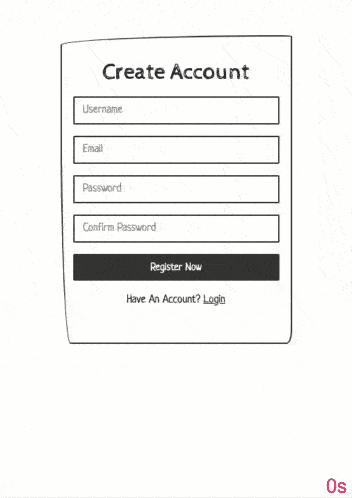

# LiveWebChatApp

It's a live web chat application written in TypeScript with user login and registration system (with [Mongo](https://www.mongodb.com/) database). <br> 
Used in this project: 
* [Node.js](https://nodejs.org/en/), 
* [Express.js](https://expressjs.com/), 
* [Socket.io](https://socket.io/), 
* [Passport](http://www.passportjs.org/), 
* [Mongoose](https://mongoosejs.com/), 
* [Bootstrap](https://getbootstrap.com/),
* [EJS](https://ejs.co/) ,
* and some other packages...

To hash password in database was used [bcrypt.js](https://github.com/dcodeIO/bcrypt.js) module with random generated salt.
## Usege 
```bash
$ npm install
$ npm-run-all build start
# or run with Nodemon
$ npm run dev
```

## Env example
To loads environment variables was used [dotenv](https://github.com/motdotla/dotenv). <br>
.env file must be in root directory
```env
NODE_ENV=development

SERVER_PORT=8080
DB_CLUSTER=
DB_USER=
DB_PASS=
SESSION_SECRET=
```
in DB_* add your MongoDB credentials (local or [Atlas](https://www.mongodb.com/cloud/atlas))


## Demo Overview (gifs)
<p align="center" >
  <table align="center">
  <tr>
    <th>login</th>
    <th>chat room</th>
  </tr>
  <tr>
    <th></th>
    <th></th>
  </tr>
  <tr>
    <th>login (password incorrect)</th>
    <th>login (user doesn't exist)</th>
  </tr>
  <tr>
    <th></th>
    <th></th>
  </tr>
  <tr>
    <th>register</th>
    <th>register (user already exist)</th>
  </tr>
  <tr>
    <th></th>
    <th></th>
  </tr>
  </table>
</p>